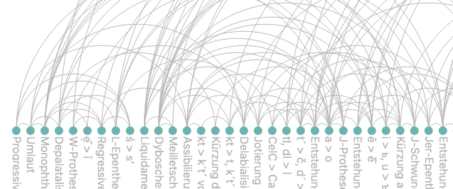

    

# A Relative Chronology of Sound Changes in Russian
This web app visualizes a relative chronology of sound changes that have occurred in the Russian language from Proto-Slavic to the present day. It allows users to inspect inividual changes and their relative datings, and view examples for that sound change.

# Running the Project Locally
The web app runs on a Python flask server and can be run locally.
Step-by-step guide:
- Install [Python](https://www.python.org/downloads/) if you haven't already
- Install flask via pip by typing `pip install flask` into the command line
- Download or clone this repository
- Via the command line, navigate to its root folder
- Execute `python3 app.py`
- The script should run and output a URL which you can open in your browser to see the web app
